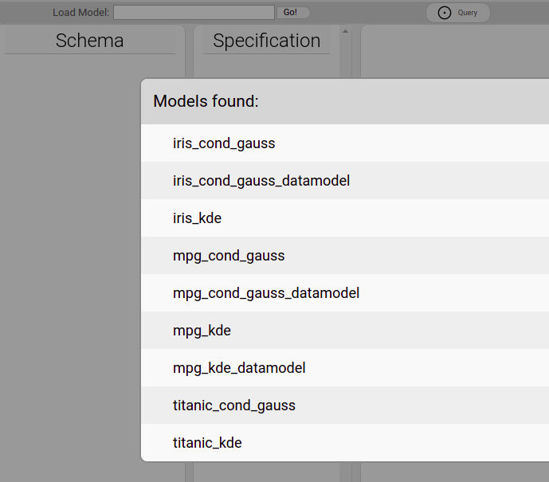
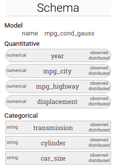
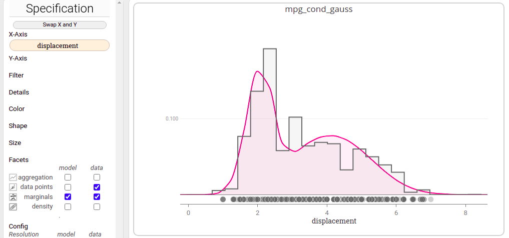
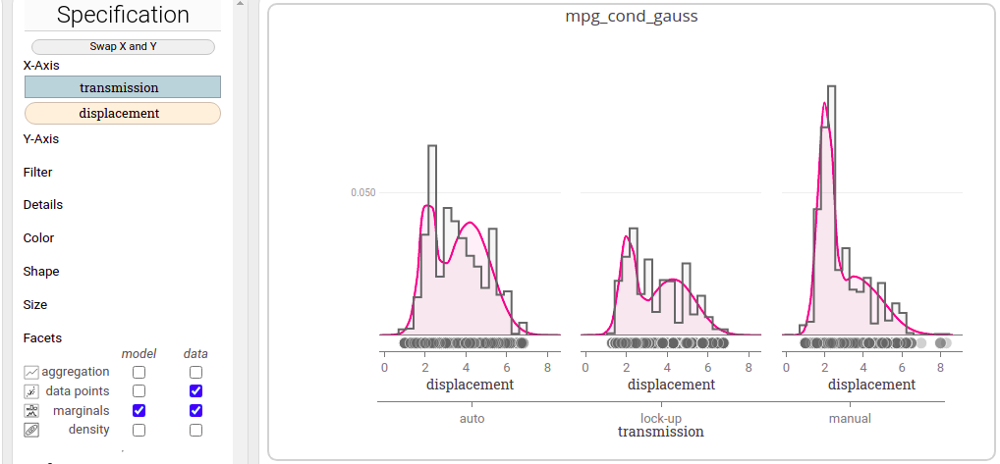
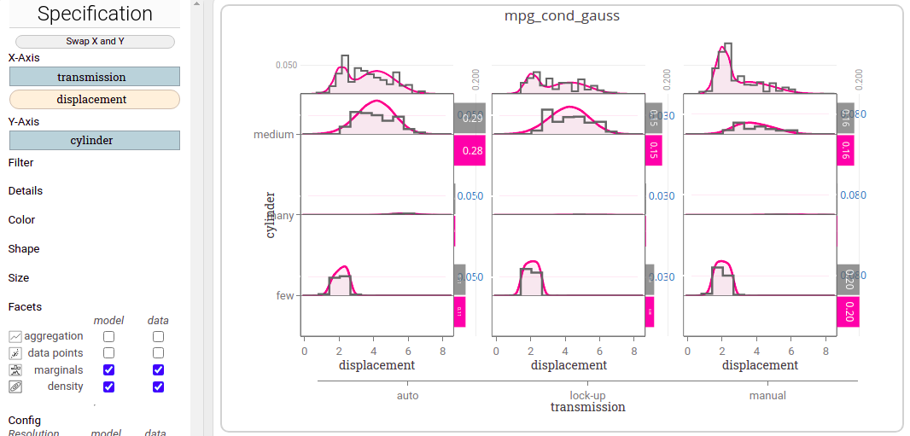
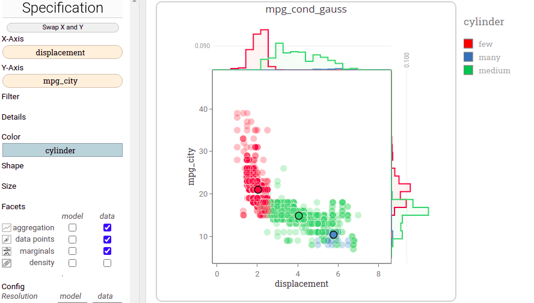
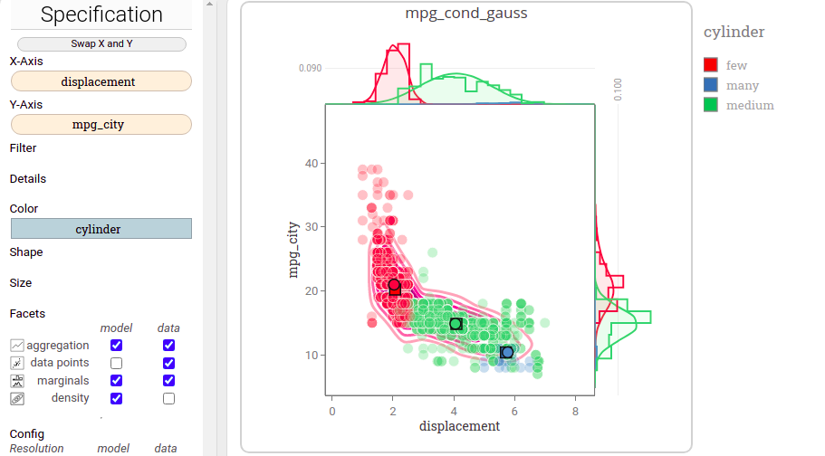

# Walk-through: a step-wise introduction to `lumen`

# Overview 

This document shows a step-by-step example how to use `lumen` to analyze and explore a given probabilistic model.
Specifically we will have a look a Conditional Gaussian (CG) distribution fitted to the popular **.
The data set contains yearly fuel economy data provided by the EPA (http://www.fueleconomy.gov/feg/download.shtml) for the years from 1978 to 2008.
Each data entry corresponds to a car model, and for each car model a number of attributes have been recorded. 

For a more comprehensive explanation of the features and usage of `lumen` please refer to the .

`lumen` requires an instance of `modelbase` as its backend that hosts all models and executes any queries to these models.
If you follow the  a Conditional Gaussian (CG) model on the mpg cars data set is trained as part of the setup process and should be available right away for exploration when you run `lumen`.
So, if you like you can follow this guide right away and try it out yourself!

In this walk-through we will touch the following aspects

 * learn: understand concepts of Conditional Gaussian (CG) distributions
 * explore: discover and explain interesting structure of the model
 * validate: spot, identify, and explain data or model artifacts

All figures shown here are screenshots of Lumen.
However, to reduce the required screen space we cropped the full screenshot to only show the lastly modified visualization.
Note that the dashboard in Lumen may hold many visualizations at once.

# 01: Start Up Applications

 1. Start the`modelbase` web-service by executing `webservice.py` of the `modelbase` backend.
 2. Run `lumen` by opening the `index.html` in your browser (best is chrome-based). 
 You should see a list of available model (the models provided by the backend) as follows:

 

 3. Click on `mpg_cond_gauss` to load that model. 
 An empty specification and empty visualization is now shown and we can start to create our visualizations.
 However, lets first have a look at the Schema panel on the left:

 As we can see the model contains a total of 7 random variables, and since we use a Conditional Gaussian (CG) model all of them are backed by observed data and all are 'random' variables modeled by the probabilistic model.

 
 Here is what the variables mean:

  * `year`: the year the vehicle was sold
  * `mpg_city`: measures the average miles per gallon in the city for the vehicle
  * `mpg_highway`: measures the average miles per gallon on the highway for the vehicle
  * `displacement`: measures the engine displacement in cubic centimeters  
  * `transmission`: describes what kind of transmission that car has as categories of `auto`, `lock-up`, and `manual`.
  * `cylinder`: describes how many cylinders the engine has categorized to `few`, `medium`, and `many`.
  * `car_size`: describes the physical size of the car categorized to `small`, `midsize`, and `large`.

# 02: Exploring the Conditional Gaussian Model

Let's have a look at the uni-variate marginal distributions of `mpg_highway`.
To do so, we drag the variable onto the X-Axis shelf. 
Since by default only data facets are activated, this results in a visualization of the data only. To also show model marginals, we check the respective facet `model - marginals`.

The visualization shows that the data (grey) and the model (pink) fit quite neatly (for this marginal).
In particular, the Conditional Gaussian (CG) model succeeded in capturing the multi-model structure of the data (here two modes, that is local maxima, are visible).

A Conditional Gaussian (CG) model effectively models the joint distribution over all variables (both quantitative and categorical) by fitting a multivariate Gaussian distribution for each combinus to explain the structure of the data and potentially identify semantic clustersation of categorical values. 
Hence, the CG distribution could help . 
Here, we raise the question which of the categorical attributes are linked to the multi-modality?

We can simply try it out. Let's assign the categorical variable `transmission` to the X-Axis-shelf too.
Make sure to drop it as the first element in the shelf.
This creates a hierarchical axis and we get a marginal distribution for each of the values of `transmission`:

We can see that there is a strong correlation between `transmission` and displacement, as the three marginal plots, especially the one for manual transmission, are quite different. 
However, it does not yet explain the modality of the marginals.

Hence, we also add the variable `cylinder` to our specification.
This time, we drag it onto the Y-Axis shelf. 
Also, we enable the facet `model - density` and `data - density` but disable the `data points` facet.
This results in a table-like visualization. 
Let's quickly explain what we see: 
There is a 'central' 3x3 array of plots that show the (marginal) distribution of `displacement` conditioned on all combinations of value for  `cylinder` and `transmission`. 
Note the middle row carries almost no probability and hence resembles a extremely flat curve.
On the very top there are three more marginal distribution plots, one for each column of the 3x3 array of plots.
Finally, the horizontal bar plots visualize another marginal, namely, the (categorical) distribution of `cylinder` given a particular value of `transmission`.

There is a number of interesting observations here:

First, the newly included variable `cylinder` appears to explain the multi-modality: In each column of the table-like visualization we see how the conditional marginal distribution (top) decomposes into three uni-modal parts (rows of the table).

Second, there are almost no cars with many cylinders (middle row).
This may either indicate a poor choice for data preprocessing (here we have categorizes the originally numerical value for `cylinders`), or simply an interesting observation, namely, that there are few car models with many cylinders.

Often the exploration process leads to some insight that, once found, can be visualized explicitly very nicely. 
Here, `cylinder` appears to be an important variable, yet there is some doubts about its validity. 
Let's create a new plot (select the model in the toolbar -> Load Model -> Go!). 
This time we encode `cylinder` as color but plot two quantitative variables (`mpg_city` and `displacement`) on the positional channels (X-Axis and Y-Axis-shelf).
Also, we enable the `data-aggregation` facet. 
It will indicate the average `displacement` and `miles per gallon`.

Note that this is a visualization of the *data* only. 
Yet, we see a very distinct clustering according to the value of `cylinder`.

Let us activate the model facets for aggregation, marginals and density. 
The resulting visualization shows a very good fit of the models distribution (pink contour plot in the background) of `displacement` and `mpg_city` to the observed data (marks with white strokes).
Additionally, the marks of the aggregation facets (marks with black stroke) are very close, confirming the good fit also on a higher level of aggregation.

