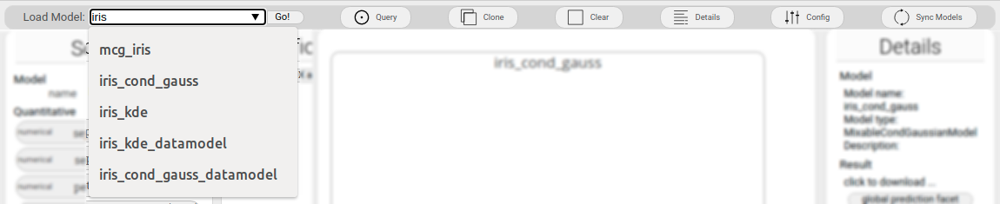
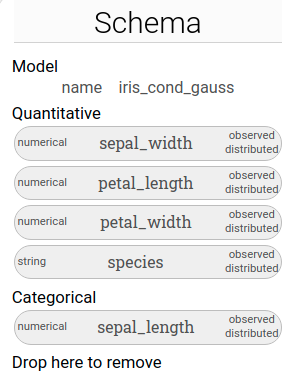
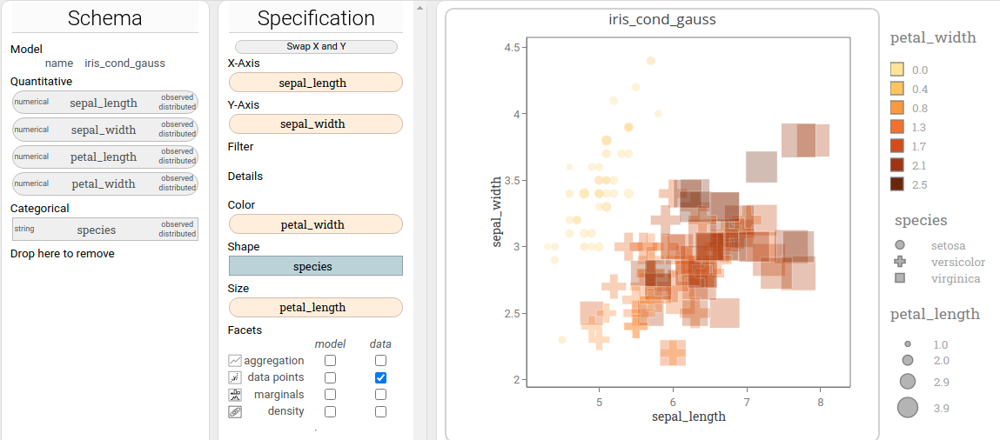
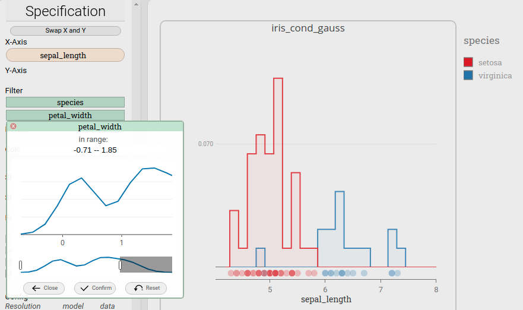
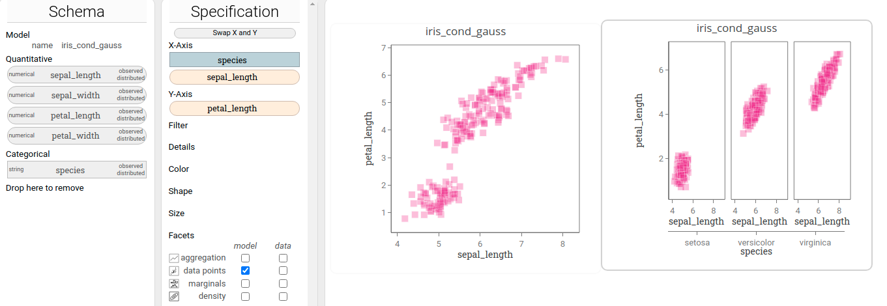
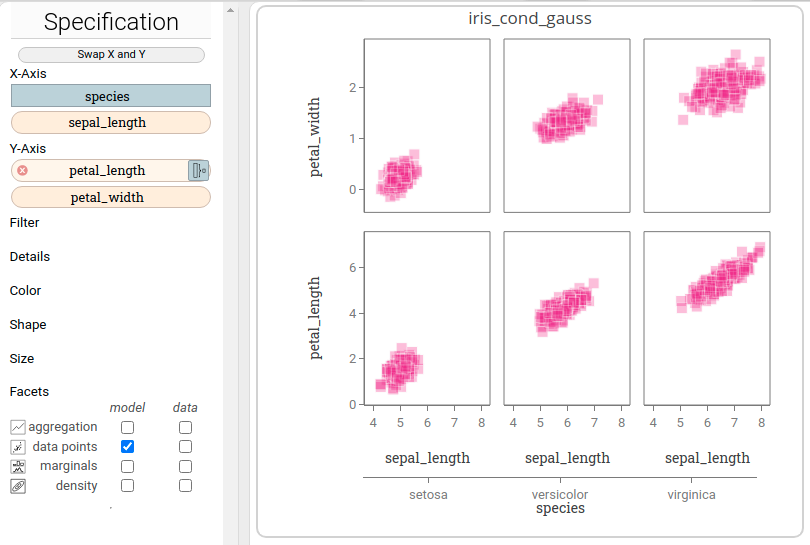
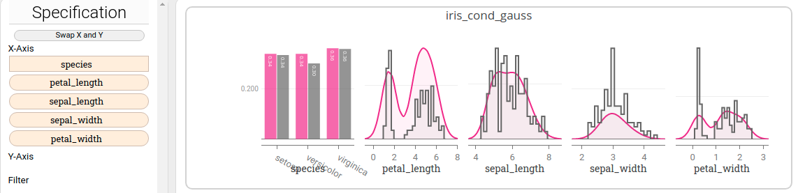
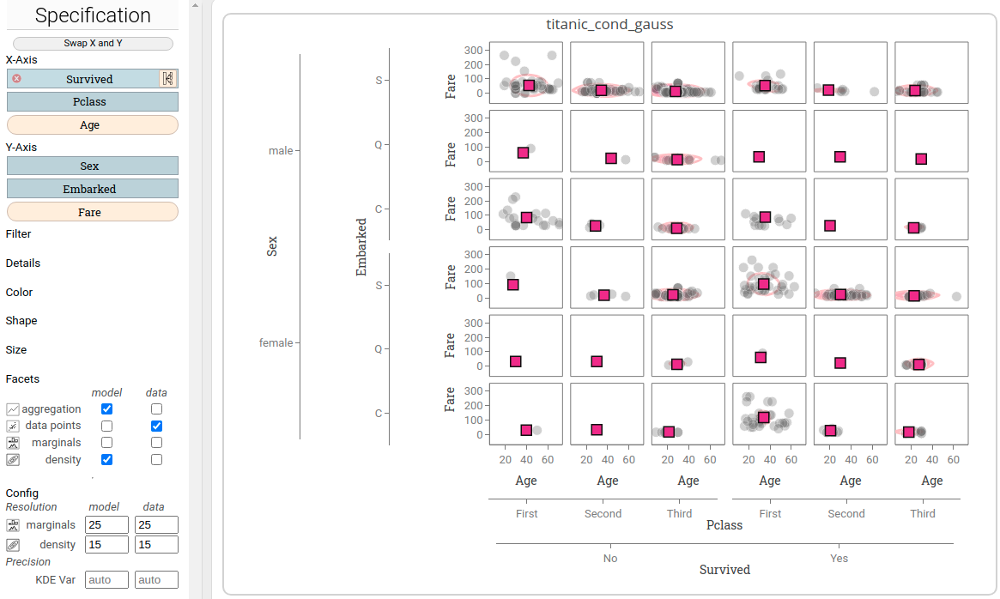

This document is intended as a user manual explaining *Lumen's* user interface (UI) and the interactions it provides.

In a few sentences it could be summarized as follows:

*Lumen* allows you to visually explore probabilistic models and their data.
You, the user, assigns attributes of the data / random variables of the model to visual variables
by drag'n' drop interactions to specify what part of the model/data you would like to see and how this model/data is visually encoded. 

# Overview

These are the five main components and their most important function

 1. Toolbar: Load models and create new visualizations
 2. Schema panel: Shows the data attributes / variables of the model shown in the active visualization.
 3. Specification panel: Lets you modify the assignment of data attributes  / variables of the model to visual variables in order to change the active visualization.
 4. Dashboard: A pannable container that holds all the visualizations that you have created. 
 5. Visualization (contained in the dashboard): The visualization as configured in the specifcation. 

To keep things simple each visualization is associated to exactly one model and its data.
Put differently: you cannot mix multiple models in one visualization.
However, of course, you can create multiple visulizations and each visulization parts of a different model!

Also, at several points above it said 'active'. 
At any point there is exactly one 'active' visualization.
You can recognize the active visualization by its darker frame around it. 
The specification always shows the visual configuration of the active visualization.
And the schema shows the variables / attribtues of the single model that is associated with a visualization, hence, it shows the variables / attributes for the _active_ model.

And as a user you can change the active visualization and corresponding active model by simply clicking on the desired visualization in the dashboard.

---

## Toolbar

The toolbar is located on the top edge of the UI.

### Loading models / creating new visualizations

Most importantly you can create new visualizations using the toolbar.
Go to the drop-down menu on the left, select among the available models and then hit "Go!" to get a brand new, empty visualization of the selected model in the 
The newly created visualization is automatically activated, that is, the schema is represents the 
Note that _Lumen_ connects to a back-end ([modelbase](https://github.com/lumen-org/modelbase/)), which manages the models itself and executes queries on it.

### Clone Button

You can use the clone button to duplicate the currently selected visualization. 
A new visualization with identical content is created and can be used and modifying on its own.

### Clear button

The Clear button will remove all assignments to the 

### Query button

Hitting the query button will trigger of recomputation of all the queries and a recreation of teh currently selected visualization.
It's comparable to refreshing a page and skipping the cache, in case something just went wrong.. 

### Details

This will toggle a little panel to the right that shows some more details about the current model and allows you to download the data shown in the active visualization.

### Config

Toggles another panel that shows advanced configurations to change colors, opacity, strokes and much more. 

---

## Schema

The schema lists all variables of the model's variables / data attributes.
It groups them by their scale type, here simplified to 'quantitative' and 'categorical'.

Here, the schems lists the variables for a model with name 'Iris_cond_gauss'. 

This model has five variables, four of them quantitative (`sepal_lenght`, `sepal_width`,`petal_lenght`,`petal_width`) and one categorical (`species`).
This model has no latent (non-observed) variables, hence all variables are labelled as 'observed'.
Also, all of the listed variables are actually modelled by the model, hence they have the label 'distributed'. 

---

## Specification

The specification consists of a number of so-called shelves (top), the semantic facet selector (middle), and some advanced configurations (buttom).

### Shelves

The shelves represent visual variables, and allow you to configure two things at once:

 1. what part of the data / what sub-model you want to visualize
 2. how you want to visualize it

In short these two things are done as follows

 * _what_: by assigning variables to the specification at all. Variables that are not in the specification will be removed from a model before the model is visualized (--> marginalization and conditioning of models)
 * _how_: by assigning variables to specific shelves. Each shelf has its own semantic, as explained in the following.

#### X-Axis and Y-Axis shelf

These two shelves represent the positional channels. 
In the above example `sepal_width` is assigned to x-axis, hence, in the visualization the x-axis encodes the values of `sepal_width`. Quite simple, eh?
Not suprisingly, it works the same for y-axis.

#### Color, Shape and Size shelf

This is quite straight forward too: 
Assigning a variable here, will cause the visualization to use color/shape/size to encode the value of this variable.

Have a look at the following 5-dimensional (!) visualization:

It encodes all of the information in the iris data. 
Obvisously, some information is easier to recognize than other, but that's a trade-off we always have to deal with.

#### Filter shelf

Using the filter shelf you can specialize the data and model to show.
It allows you to restrict the values that variables/have may have. 
After assigning a variable to the shelf, you can click on the shelf item to open a modal dialog.
Here, you can restrict the interval (for quantitative) and set (for categorical) of allowed values. 

Here, the value of `petal_width` is restricted to values small than 1.85 (as shown in the modal dialog), and the values for `species` are restricted to 'setosa' and 'verginica' only excluding 'versicolor'. As you can see in the visualization, under these conditions, 'setosa'  and 'virginica' can be separated almost perfectly just using `sepal_length`.

#### Defaults shelf

### Visual Defaults

With the specification panel Lumen gives a lot of flexibility to you, which may be a bit overwhelming at first. 
But it's quick to get used to, don't worry.
Also, to make it easy for you to keep facets apart and understand plots, Lumen takes many default decision for you too.
As a rule of thumb: 

 * aggregation marks have a black stroke and high opacity
 * data points / samples from models have a white stroke and low opactiy
 * model-related marks are pink, on a pink scale, and/or square
 * data-related marks are grey, on a grey scale, and/or circle
 * within one visualization all encodings are comparable, which is, they are on the same scale

Note that many of the defaults can be overridden by using the specification. 

### Facets

Facets act as 'semantic layers', that is, they represent different aspects.
Lumen provides eight facets organizes in two columns and four rows:

**Columms:**
 
 * model column: facets here represent aspects of the _model_
 * data column: facets here represent aspects of the _data_ that the model was trained on

**Rows:**

 * aggregation: Adds marks for aggregated (summarized) values to the visualization.
 * data points: Adds marks for data points (data) and samples (drawn from the model) to the visualization.
 * marginals: Adds marginal distribution plots to the visualization. 
 * density: Adds density distribution plots to the visualization
 
### X-Axis and Y-Axis shelves revisited
 
The above description of the x-axis and y-axis shelves only told half the story,
because you can actually assign multiple variables to these shelves.
This allows you to create 'tabular arrangments' of plots within a single visualization.

Let's have a look at an example:

For the left visualization left we created a scatter plot of model samples drawn from the probailistic model by dropping `sepal_lenght` on the x-axis shelf and `petal_length` on the y-axis shelf.
For the right visualization, we cloned the visualization, dragged the `species` variable from the schema, and dropped it on the x-axis shelf. 
The visualization now contains thres scatter plot, namely one for each values of species, instead of only one.
Note how all individual plots share both the x and y-axis.
Here, `species` is used to group split the single plot into individual ones, creating an additional hierarchical x-axis on the bottom.

Instead of a creating a hierarhcy you can also just 'add' an another variable to the horizontal or vertical layout.
For the following visualization we dropped `petal_width` to the y-axis shelf (and resized the plot).
Notice how there is _no_ hierarchical axis, and instead `petal_width` is just added next to `petal_length`.

In short, "blue" shelf items create hierarchies and "yellow" shelf items concatenate axis. 
You can swap between "blue" and "yellow" by hovering on a shelf item and clicking the yellow/blue button

There is no explicit limit on how many variables you may add to the positional shelves. 
Here is two more examples that illustrate useful applications.
This visualization contains all data and model marginals of the `iris_cond_gauss` model in one visualization:

This visualization shows sevaral facets for `age` over `fare` for all combinations of the four variables `sex`, `embarked`, `passanger class(Pclass)`, and `Survived`. 
In visualization this kind of a plot is often referred to as 'small multiples'.

