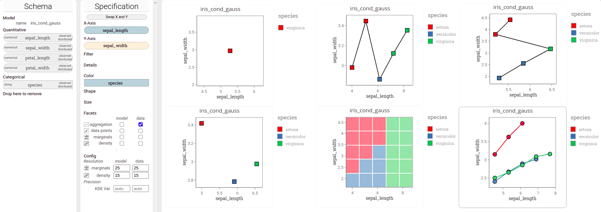
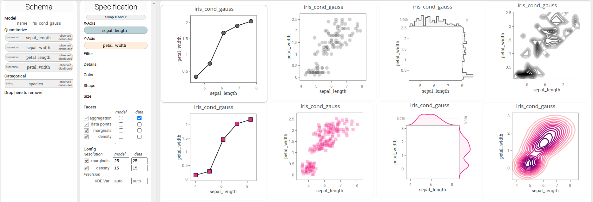

This document provides an introduction to `lumen` and its user interface.

In a few sentences `lumen` could be summarized as follows:

`lumen` allows you to visually explore probabilistic models and their data.
You, the user, assign attributes of the data / random variables of the model to visual variables by drag-and-drop interactions to specify what part of the model/data you would like to see and how this model/data is visually encoded. 
A number of combinable 'semantic layers' allow you to visualize different aspects of the model and data.

# Overview

These are the five main components and their most important function, see also the screenshot.

 1. Toolbar: Load models and create new visualizations
 2. Schema panel: Shows the data attributes and random variables of the model that is shown in the active visualization.
 3. Specification panel: Lets you modify the assignment of data attributes  / random variables of the model to visual variables in order to change the active visualization.
 Also, it lets you choose which semantic facets to enable.
 Facets are layers in a visualization that show a particular aspect of model and its data.
 4. Dashboard: A pannable container that holds all the visualizations that you have created on an virtually infinite canvas.
 5. Visualization (contained in the dashboard): The visualization as configured in the specification. 
 No limits on how many visualizations you can have at once on the dashboard.

To keep things simple each visualization is associated to exactly one model and its data.
Put differently: you cannot mix multiple models in one visualization.
However, of course, you can create multiple visualizations, each of a different model.

At several points above it said 'active': 
At any point there is exactly one 'active' visualization.
You can recognize the active visualization by its darker frame around it, compared to the rest of the visualizations.
The specification panel always shows the visual configuration of the active visualization.
Hence, when you modify the specification, you always modify the currently active visualization.
Also, the schema panel shows the variables / attributes of the single model that is associated with a visualization.
Hence, the schema shows the variables / attributes for the _active_ model.
As a user you can change the active visualization and corresponding active model by simply clicking on the desired visualization in the dashboard.

# Probabilistic Models and Random Variables
## Probabilistic Models in Lumen

The general probabilistic model explorable in `lumen` can be written as

p(X, U | Y, T)

where

 * X is the set of observed random variables,
 * U is the set of latent random variables,
 * Y is the set of observed covariates ('input' variables), and
 * T is the set of latent covariates (typically (hyper-)parameters of the model)

The basic approach of `lumen` to model understanding is that it lets the user visualize any marginal/conditional sub-models of p(X, U | Y, T) together with the 'equivalent' data slices.
Note, this requires that one can effectively compute such marginal and conditional distributions.
Hence, the appropriate model class needs to be implemented in the `modelbase` backend.

For many model classes the above density function simplifies quite a bit, as some of X,U,Y, or T are empty.
For instance, in conditional Gaussian (CG) distributions, all variables are observed random variables, and any conditional Gaussian distribution can be written as p(X).

## Random Variables and Data Attributes

`lumen` builds on the idea that random variables and corresponding data attributes can be treated the same way for the purpose of interactive visualization.
Hence, at most places we make no difference between random variables and the corresponding data attributes.
This may seem confusing at first, however, in fact it is quite natural when you consider our scenario where random variables (often) directly correspond to observed data.

This section aims to clarify on random variables / data attributes, how they are represented in `lumen`, and what properties they expose. 
In fact we use the two terms (random variable and data attribute) almost interchangeably.
However, we prefer random variable (or variable for short) to highlight the modeling aspect:

 * __data type__: A variable may either be of the numerical type or of the categorical type. 
 For instance, a variable that measures the  naturally is of the numerical type, while a variable that encode the species of an iris flower, naturally is of the categorical type.
 * __latent / observed__: A variable may or not be observed. 
 If it is observed, then corresponding data is available and you may visualize the data and aggregations of data alongside the variable. 
 If it is not observed (latent), then you can, of course, not do that.
 * __variate / covariate__:  Some variables in a model only serve as an input but are not modeled as part of the model and are not part of the output/prediction of an model.

---

# User Interface and Components

# Toolbar

The toolbar is located on the top edge of the UI.

## Loading models / creating new visualizations

Most importantly you can create new visualizations using the toolbar.
Go to the drop-down menu on the left, select among the available models and then hit "Go!" to get a brand new, empty visualization of the selected model in the 
The newly created visualization is automatically activated, that is, the schema is represents the 
Note that _Lumen_ connects to a back-end ([modelbase](https://github.com/lumen-org/modelbase/)), which manages the models itself and executes queries on it.

## Clone Button

The clone button duplicates the currently active visualization. 
On click a new visualization with identical content is created, activated, and can be used and modified on its own.

## Clear button

The clear button removes all assignments of random variables to shelves in the specification.

## Query button

Hitting the query button triggers a re-computation and re-rendering of the active visualization. 
It is comparable to forced refreshing a page that skips the cache. 
In case something in *Lumen* just went wrong, this may help ;)

## Details

The Details button toggles a little panel on the right that shows some more details about the active model and visualization.
For instance, it shows the textual description associated to it and allows you to download the data associated to the enabled facets as shown in the active visualization.

## Config

The Config button toggles  a panel that shows advanced configurations to change colors, opacity, strokes and much more.
While it is safe to use, it is more of a developer tool due to its complexity and mostly missing details documentation.

---

# Schema Panel

The schema lists all variables of the model's variables / data attributes.
It groups the variables by their scale type, here into 'quantitative' and 'categorical'.
Additionally, it provides information whether it is a observed or latent variable, and whether it is a distributed (a variate, a variable modeled by model) or a independent variable (a covariate, a variate that just serves as a required input to the model).

In this example, the schema lists the variables for a model with name 'Iris_cond_gauss'. 
The model has five variables, four of them quantitative (`sepal_length`, `sepal_width`,`petal_length`,`petal_width`) and one categorical (`species`).
As the the model does not have any latent (non-observed) variables, all variables are labelled as 'observed'.
Also, all of the listed variables are actually modelled by the model, hence they have the label 'distributed'. 

---

# Specification Panel

The specification consists of a number of so-called shelves (top: *X-Axis* to *Size*), the semantic facet selector (middle: :*Facets*), and some advanced configurations (bottom: *Config*).
See also the example below.

## Shelves

The shelves represent *visual channels*, and allow you to configure two things at once:

 1. what part of the data / what sub-model you want to visualize
 2. how you want to visualize it

In short these two things are done as follows

 * _what_: by assigning variables to the specification at all.
 Variables that are not in the specification will be removed from a model before the model is visualized (-> marginalization and conditioning of models)
 * _how_: by assigning variables to specific shelves.
 Each shelf has its own semantic, as explained in the following.

### X-Axis and Y-Axis shelf

These two shelves represent the positional channels. 
In the above example `sepal_width` is assigned to *X-Axis*, hence, in the visualization the x-axis encodes the values of `sepal_width`. Quite simple, eh?
Not surprisingly, it works the same for *Y-Axis*.

### Color, Shape and Size shelf

This is quite straight forward too: 
Assigning a variable here, will cause the visualization to use color/shape/size to encode the value of this variable.

Have a look at the following 5-dimensional (!) visualization:

It encodes all of the information in the iris data. 
Obviously, some information is easier to recognize than other, but that's a trade-off we always have to deal with.

### Filter shelf

Using the filter shelf you can specialize the data and model to show.
It allows you to restrict the values that variables/have may have. 
After assigning a variable to the shelf, you can click on the shelf item to open a modal dialog.
Here, you can restrict the interval (for quantitative) and set (for categorical) of allowed values. 

In the shown example the value of `petal_width` is restricted to values small than 1.85 (see the modal dialog), and the values for `species` are restricted to 'setosa' and 'virginica' only excluding 'versicolor' (not shown explicitly, but note that green *species* field in the filter shelf). 
As you can see in the visualization, under these conditions, 'setosa'  and 'virginica' can be separated almost perfectly just using the single variable `sepal_length`.

### Details shelf

The details shelves is only relevant for the *aggregation facet* and is discussed further down.

### Details shelf

All the shelves described so far did both: select variables to include in the visualization (the 'what?') and assign visual channels for their visualization (the 'how?').
The Details shelf only adds a variable to the visualization (what), but *without* assigning a visual channel (how).
See the next Section on roles of variables usages:

## Aggregating and Grouping of Variables

Actually, for each usage of a variable (that is any assignment of a variables to a shelf in the specification) you configure a third aspect, namely the *role* of that variable when aggregating data or model:

For each variable `X` you can choose whether:

 * `X` is grouped by (light blue fill of variables usage in shelf of specification), or
 * `X` is aggregated/predicted (light yellow fill of variables usage in shelf of specification).

Note that the details shelf and the configuration to group or aggregate only is relevant for the *aggregation facets*, see below.

It's easy to understand with some examples.
The screenshot below shows an arrangement of 2x3 visualizations.
*All specifications are identical except for the assigned roles of the variables.*
 
 * Top-left: Aggregate (predict) all three variables. The shown dot represents the single point that is most likely for *sepal_length*, *sepal_width*, and *species*.
 * Top-middle: aggregate (predict) *sepal_width* and *species*, but group by *sepal_length*.
 For each value of the grouping an aggregation/prediction is made.
 Here, *sepal_length* is grouped into 5 values equidistantly chosen along its observed extent of values.
 * Top-right: Aggregate (predict) *sepal_length* and *species*, but group by *sepal_width*.
 * Bottom-left: Aggregate *sepal_length* and *sepal_width* and group by *species*. Hence, the most likely value for the two quantitative variables is computed and shown *per category value* of species.
 * Bottom-middle: Aggregate (predict) *species* grouped by both *sepal_width* and *sepal_length*. For each raster element the most likely species is shown.
 * Bottom-right: Given *sepal_length* and *species* predict *sepal_length*.

To change wether a variable is grouped by or aggregated/predicted simply click on the tiny icon that shows up on the right when hovering on a variable in a shelf.

## Visual Defaults

The specification panel in *Lumen* gives a lot of flexibility to you, which may be a bit overwhelming at first. 
But it's quick to get used to, don't worry.

Also, to make it easy for you to keep facets apart and understand plots, Lumen takes many default decision for you too to ensure that plots are consistent and easy to understand:
The default visual encodings are as follows:

 * model-related marks are pink, on a pink scale, and/or square
 * data-related marks are grey, on a grey scale, and/or circle
 * aggregation marks have a black stroke and high opacity
 * data points / samples from models have a white stroke and low opacity
 * within one visualization all encodings are comparable, which is, they are on the same scale

Note that many of the defaults can be overridden by using the specification.

## Facets

Facets act as 'semantic layers', that is, they represent different aspects.
*Lumen* provides eight facets organizes in two columns and four rows:

### Columns
 
 * model column: facets here represent aspects of the _model_
 * data column: facets here represent aspects of the _data_ that the model was trained on

### Rows

 * aggregation: Adds marks for aggregated (summarized) values to the visualization.
 * data points: Adds marks for data points (data) and samples (drawn from the model) to the visualization.
 * marginals: Adds marginal distribution plots to the visualization. 
 * density: Adds density distribution plots to the visualization

For an illustration, see this 2 by 4 arrangement of eight individual visualizations. 
All have the identical specification, however, each has exactly one facet only  activated.
Rows are data and model, and columns are aggregation, data points, marginals and density facets, respectively.

 
## Tabular visualizations: X-Axis and Y-Axis shelves revisited
 
The above description of the x-axis and y-axis shelves only told half the story,
because you can actually assign multiple variables to these shelves.
This allows you to create 'tabular arrangements' of plots within a single visualization.

Let's have a look at an example:

For the left visualization left we created a scatter plot of model samples drawn from the probabilistic model by dropping `sepal_length` on the x-axis shelf and `petal_length` on the y-axis shelf.
For the right visualization, we cloned the visualization, dragged the `species` variable from the schema, and dropped it on the x-axis shelf. 
The visualization now contains three scatter plots, namely one for each value of `species`, instead of only one.
Note how all individual plots share both the x and y-axis.
Here, `species` is used to group split the single plot into individual ones, creating an additional hierarchical x-axis for `species` on the bottom.

Instead of a creating a hierarchy you can also just 'add' (concatenate) another variable to the horizontal or vertical layout.
For the following visualization we dropped `petal_width` to the y-axis shelf (and resized the plot).
Notice how there is _no_ hierarchical axis and instead `petal_width` is just added next to `petal_length`.

How do you specify whether to create an hierarchical axis or just concatenate?
Here, we reuse the assignment of variables usage to 'aggregating' or 'grouping', see the Section *Aggregating and Grouping of Variables*.
In short, "blue" shelf items create hierarchies and "yellow" shelf items concatenate axis. 
You can swap between "blue" and "yellow" by hovering on a shelf item and clicking the yellow/blue button.

There is no explicit limit on how many variables you may add to the positional shelves. 
Here is two more examples that illustrate useful applications.
This visualization contains all data and model marginals of the `iris_cond_gauss` model in one visualization:

This visualization shows several facets for `age` over `fare` for all combinations of the four variables `sex`, `embarked`, `passenger class(Pclass)`, and `Survived`. 
In visualization this kind of a plot is often referred to as 'small multiples'.

---

# Interaction

In Lumen the mouse is the primary interaction device. 
It's made with the idea to be (hopefully) intuitive, and most of the available interaction have already been used or mentioned on in the descriptions above.

Anyway, here is a list of what you can do:

## Working with Variables
* assign variables to visual channels or other shelves by dragging and dropping them between the various shelves in the Schema and the Specification
* remove the assignment of a variable to a shelf by dragging that variable and dropping it 'anywhere'
* reorder variables within a shelf by dragging and dropping them
* open modal dialog to further configure a variable usage in the specification by clicking on it
## Facets
* enable and disable a facet by checking or un-checking it in the specification panel
## Handling Visualizations in the Dashboard
* resize visualizations by dragging the edges of it
* move visualization on the Dashboard by dragging the background of a visualization
* pan the dashboard by dragging the background of the Dashboard
## Zooming and Data in a Visualization
* zoom into a visualization by selecting the desired subregion with the mouse. This work on the marginals as well.
* zoom out to default by double clicking on a visualization
* hovering over marks to show their variable values